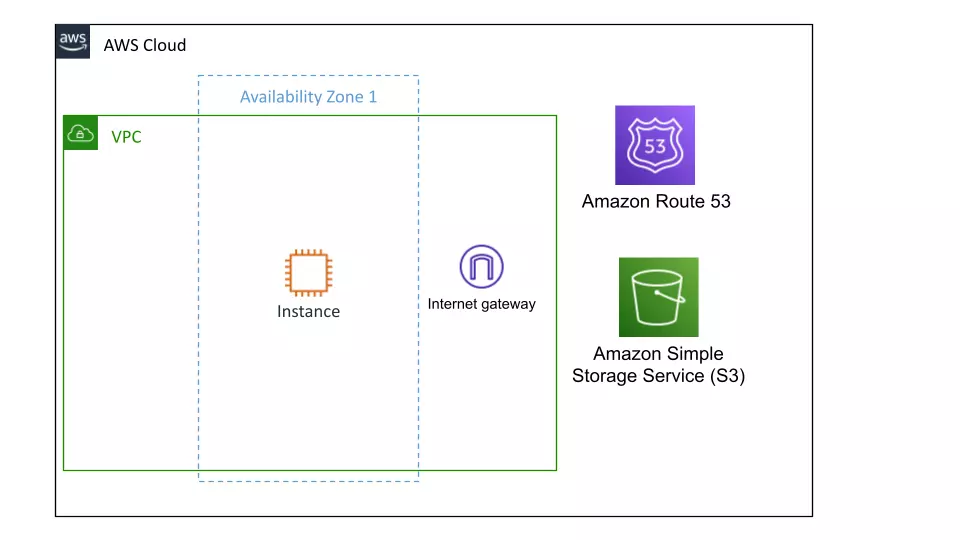
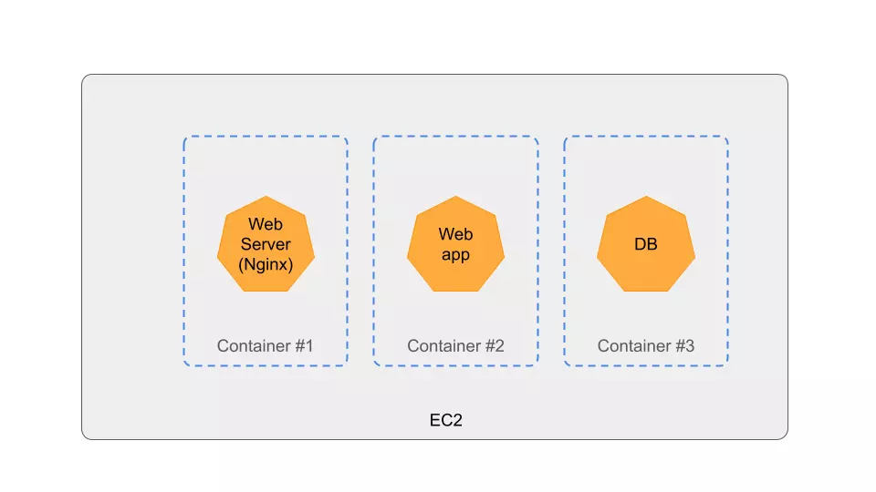

# Simple web application on AWS

This CDK stack creates AWS cloud infrastrucutre for deploying a web application on a single EC2 instance.



AWS Services used:
* VPC with internete gateway.
* Single EC2 instance to run the web application. This EC2 instance is assigned an EIP. The users connect directly to this EIP. No load balancer is used.
* Two EBS volumes as the root disk and the data disk of the EC2.
* S3 bucket to host the media files. The EC2 instance is assigned an IAM role to allow write permission to the S3 bucket.
* Route53 hosted zone and A record with tartget to IP address of the EIP.

# Using the CDK stack for production.

For production use. you must update the stack to retain the S3 bucket and the EBS volumes when destroying the stack.

Update the `removalPolicy of S3 bucket:
```TypeScript
removalPolicy: cdk.RemovalPolicy.RETAIN // Set to retain for a production app
```

Set `deleteOnTermination` to false for both EBS volumes:
```TypeScript
deleteOnTermination: false
```

# Deploying the CDK stack

```shell
$ npm run build
$ npm cdk deploy
```

> You will be charged for the AWS resources.

Now you can deploy the web application on the EC2.

# Deploying the web application



> Tthis project does not include the source code for the web application.

Install Docker on the EC2 and deploy the web server, the web application, and the database server using Docker Compose.

For details on how to deploy a web application on Docker checkout this [tutorial](https://cloudqubes.com/tutorial/deploying-rails-7-on-docker/).

This architecture is suitable for a hobby project, or a very small scale web application since we are not using a load balancer.

If you want to deploy a fully fledged web application checkout the [three-tier-webapp](https://github.com/indikaimk/aws-projects/tree/main/three-tier-webapp)

# Destroy the stack

```shell
$ npm cdk destroy
```

## Useful commands

* `npm run build`   compile typescript to js
* `npm run watch`   watch for changes and compile
* `npm run test`    perform the jest unit tests
* `npx cdk deploy`  deploy this stack to your default AWS account/region
* `npx cdk diff`    compare deployed stack with current state
* `npx cdk synth`   emits the synthesized CloudFormation template
