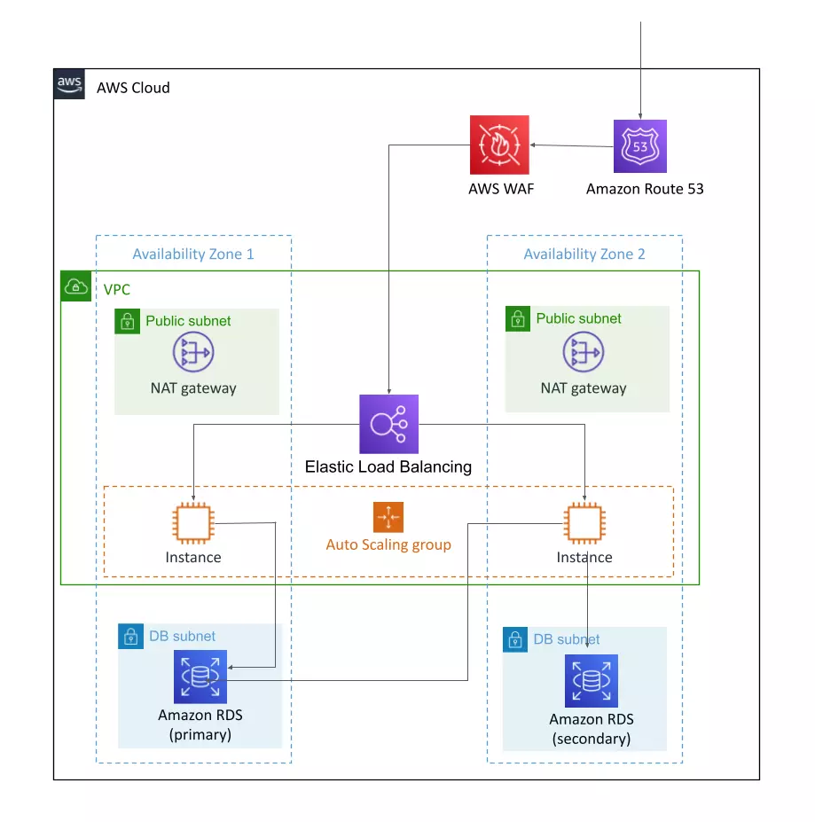

# Three-tier web application on AWS

This CDK stack creates AWS cloud infrastrucutre for deploying a three-tier web application on AWS



However, as AWS recommends this stack does not use separate EC2 instnces for web server. Instead we deploy both web server and the web application on the same EC2 on Docker and avoid the use of two ALBs.

# Deploying the CDK stack

```shell
$ npm run build
$ npm cdk deploy
```

> You will be charged for the AWS resources.

Now you can deploy the web application on the EC2.

For details on how to deploy a web application on Docker checkout this [tutorial](https://cloudqubes.com/tutorial/deploying-rails-7-on-docker/).

# Destroy the stack

```shell
$ npm cdk destroy
```


## Useful commands

* `npm run build`   compile typescript to js
* `npm run watch`   watch for changes and compile
* `npm run test`    perform the jest unit tests
* `npx cdk deploy`  deploy this stack to your default AWS account/region
* `npx cdk diff`    compare deployed stack with current state
* `npx cdk synth`   emits the synthesized CloudFormation template
